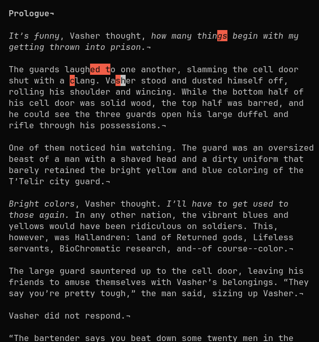

# ept


*typing errors highlighted in red*

Practice typing while reading books (from the terminal).

```
ept

ARGS:
    <path>
      Path to book. Must refer to a valid EPUB file.

OPTIONS:
    -w, --width <width>
      Width of text view, in characters.
      Defaults to 60.

    -h, --help
      Prints help information.
```
